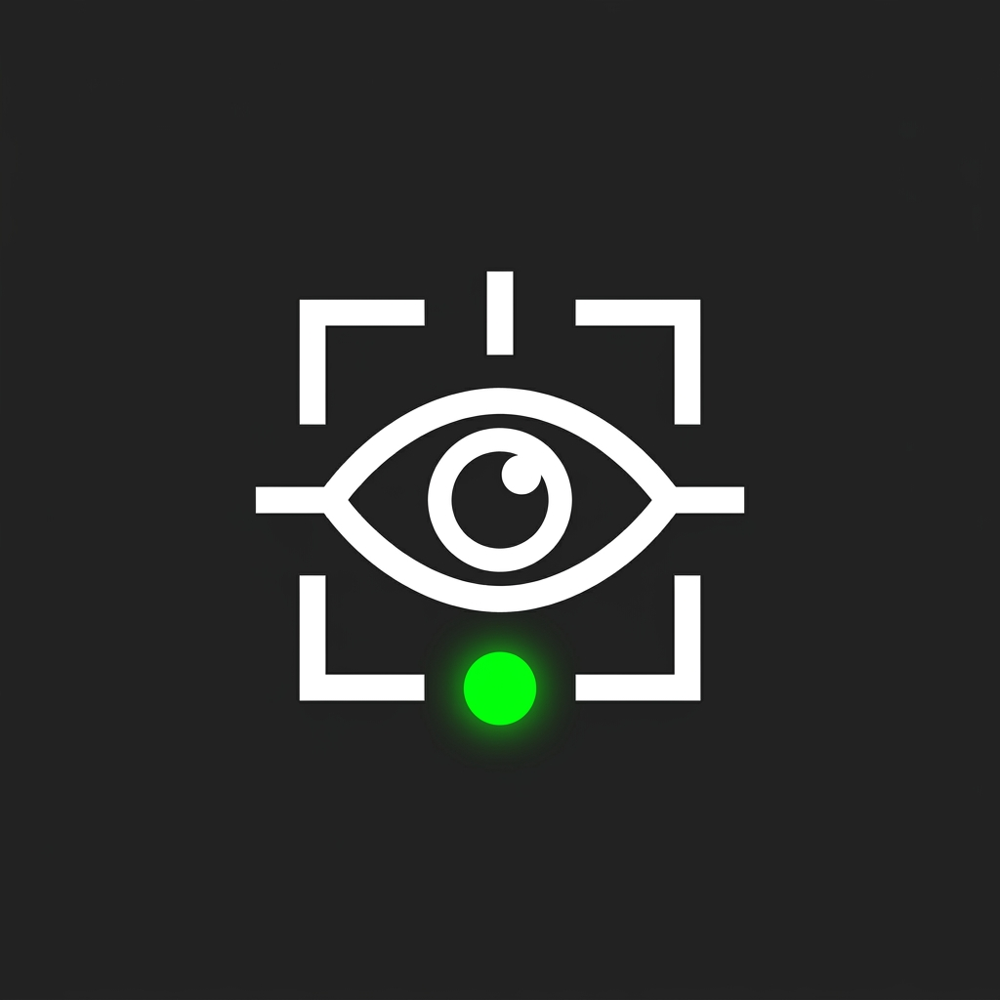

# Fika Downed Spectator

A quality-of-life client plugin for **Fika** that allows players to spectate their teammates in first-person while in the **Downed (bleedout)** state, instead of staring at a static black screen.

---

## ✨ Features
* **Seamless Spectating while Downed:** Press **`[ V ]`** whenever you are knocked down to switch cameras and watch your teammates fight in real-time.
* **Return to Body Anytime:** Press **`[ V ]`** again to immediately return to your downed body to monitor bleedout or prepare for a teammate's revive.
* **Switch Between Players:** Use **Left Click (LMB) / Right Click (RMB)** to cycle through all alive teammates.
* **Native Tarkov HUD Banner:** Features a clean, tactical top-center banner styled with Tarkov's authentic **Bender** font and color palette (fully scaled for 1080p, 1440p, and 4K displays).
* **Zero Conflicts:** Seamlessly co-exists with Fika without modifying any core multiplayer netcode.

---

## 🎮 Controls (Configurable)
* **`V`** : Toggle Spectate / Return to Downed Body
* **`LMB / RMB`** : Cycle Teammates
* *(All keybinds and banner positions can be customized in the BepInEx Configuration Manager or in `BepInEx/config/com.zephyros.fikadownedspectator.cfg`)*

---

## 📦 Requirements
* **SPT:** 4.0.0+ (Tested on SPT 4.1.x)
* **Fika:** 2.4.0+

---

## 📥 Installation
1. Download the latest release `.zip` from the Releases page or Forge.
2. Extract the archive.
3. Drag and drop the `BepInEx` folder directly into your SPT root directory.

---

## 👤 Author
* **Zephyros**

---

## 📄 License
This project is licensed under the MIT License - see the [LICENSE](LICENSE) file for details.
